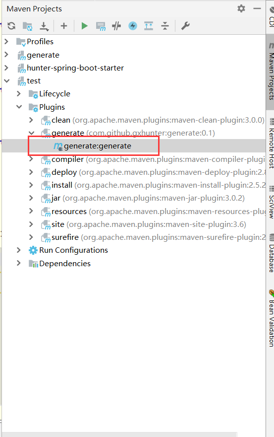

# 说明

基于mybatis-plus 代码生成器的一个maven版插件。第一版仅支持mysql表逆向，生成的代码原生支持mybatis-plus。欢迎pr和提issue。

# 使用

1. 在pom中引入

   ```
    <build>
           <plugins>
               <plugin>
                   <groupId>com.github.gxhunter</groupId>
                   <artifactId>generate</artifactId>
                   <version>仓库最高版本</version>
               </plugin>
           </plugins>
       </build>
   ```

2. 在`resources`下新建一个`generator.json`的配置文件，如下

   ```
   {
     "globalConfig": {
       "outputDir": "生成目录路径",
       "fileOverride": true,
       "open": true,
       "enableCache": false,
       "author": "作者",
       "swagger2": 是否开启swagger模式,
       "baseResultMap": false,
       "dateType": "TIME_PACK",
       "baseColumnList": false,
       "idType": null
     },
     "dataSourceConfig": {
       "dbType": "MYSQL",
       "url": "jdbc:mysql://localhost:3306/o2o?useUnicode=true&useSSL=false&characterEncoding=utf8",
       "driverName": "com.mysql.jdbc.Driver",
       "username": "用户",
       "password": "密码"
     },
     "packageConfig": {
       "parent": "基础包名"
     },
     "strategyConfig": {
       "fieldPrefix": null,
       "entityBuilderModel": 是否开启建造者模式,
       "entityLombokModel": 是否开启lombok支持,
       "entityBooleanColumnRemoveIsPrefix": false,
       "restControllerStyle": 是否前后端完全分离,
       "entityTableFieldAnnotationEnable": true,
       "tableFillList": null,
       "columnNaming":"underline_to_camel",
       "naming":"underline_to_camel",
       "superMapperClass": "dao接口父类全路径",
       "superServiceClass": "service接口父类全路径",
       "superServiceImplClass": "service父类全路径",
       "superControllerClass":"Controller父类全路径"
     }
   }
   
   ```

3. 点击右侧生成按钮

   `plugins->generate->generate`
   
   

4. 按要求在控制台输入想要生成的表名，输入`all`生成逆向生成所有。

   

   


 

